# Actividad 2

### Pricing en EC2

##### Analítica Computacional para la Toma de Decisiones

---

|     Nombres      |      Apellidos       |     Login     |  Codigo   |
| :--------------: | :------------------: | :-----------: | :-------: |
|     Santiago     | Gonzalez Montealegre | s.gonzalez35  | 202012274 |
| Juliana Carolina |  Cardenas Barragan   | jc.cardenasb1 | 202011683 |

---

---

## 1. Consulte y estime los costos de los recursos en AWS

---

### 1.

Para la estimación de costos, AWS ofrece una calculadora en la página https://calculator.aws. Visite esta página.

---

### 2.

Click en Crear una estimación o Create estimate.

---

### 3.

Busque por ubicación. Seleccione la Región Norte de Virginia.

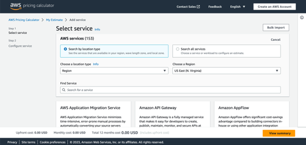

---

### 4.

En Buscar servicio ingrese EC2.

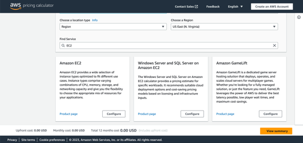

---

### 5.

La búsqueda filtra los resultados y debe mostrar una caja con una descripción de EC2, un enlace a la página del servicio y un botón Configurar. Haga click en este botón para agregar servicios de este tipo a su estimación de costos.

---

### 6.

Incluya una descripción en el primer campo con los nombres de los integrantes del grupo.

---

### 7.

Como región seleccione N. Virginia.

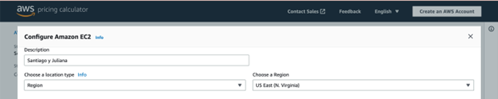

---

### 8.

Note las diferentes instancias de EC2.

---

### 9.

Inicialmente debe tener seleccionada un tipo de instancia por defecto. Registre el nombre del tipo de instancia seleccionado y sus características en su reporte.

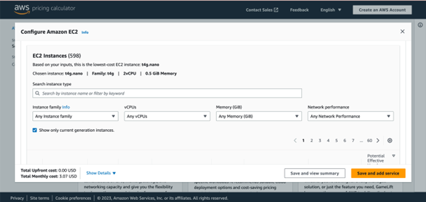

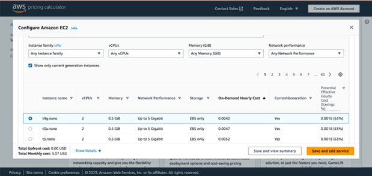

La instancia seleccionada por defecto es:

- Nombre: t4g.nano
- Familia: t4g
- vCPU: 2
- Memoria: 0.5 GiB
- Rendimiento de la Red: Hasta 5 Gigabits
- Almacenamiento: Solamente EBS
- Costo por hora bajo demanda: 0.0042 USD
- Costo potencial efectivo por hora (% de ahorro): 0.0016 (63%)

---

### 10.

En la sección Opciones de pago seleccione Bajo demanda y deje un 100 % de utilización.

---

### 11.

En la parte inferior izquierda encontrará el costo mensual, regístrelo en su reporte.

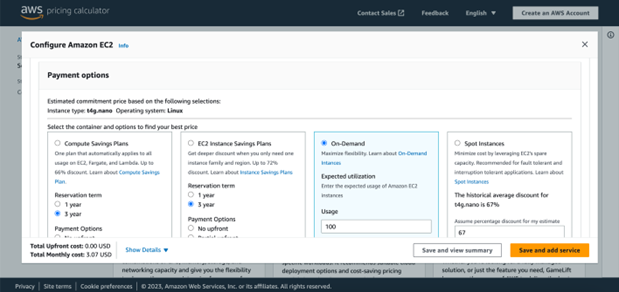

Para la instancia seleccionada por defecto el costo mensual es de 3.07 USD.

---

### 12.

Regrese ahora a la parte superior en los tipos de instancia. Note que las instancias pueden ser de diferentes tipos. Seleccione una instancia optimizada para cómputo y repita el ejercicio. Registre el costo mensual bajo demanda en su reporte.

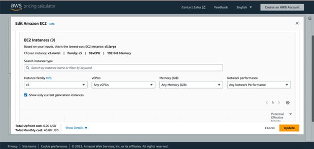

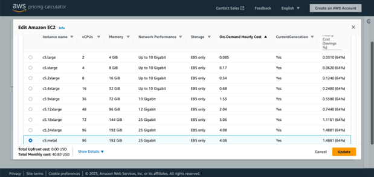

El costo de la instancia al mes es de 2,978.40 USD.

---

### 13.

Repita el ejercicio anterior con una instancia orientada a memoria. Registre el costo mensual bajo demanda en su reporte.

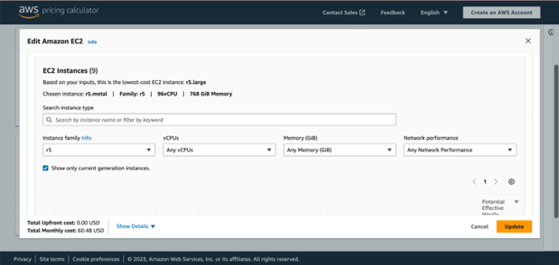

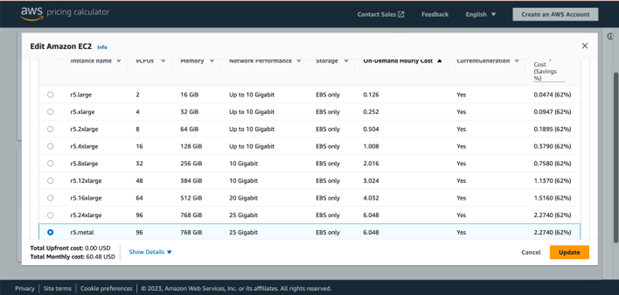

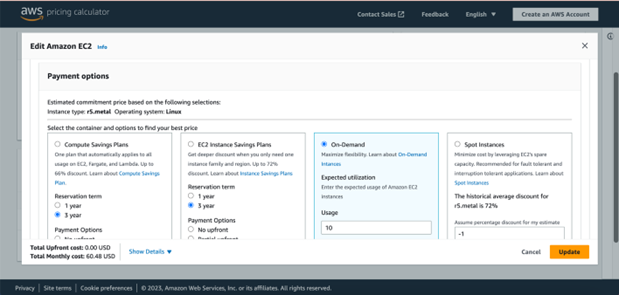

El costo de la al mes es de 60.48 USD.

---

### 14.

Repita el ejercicio anterior con una instancia con GPU. Registre el costo mensual bajo demanda en su reporte.

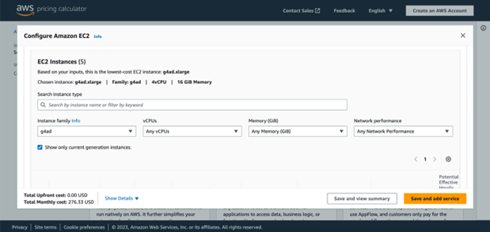

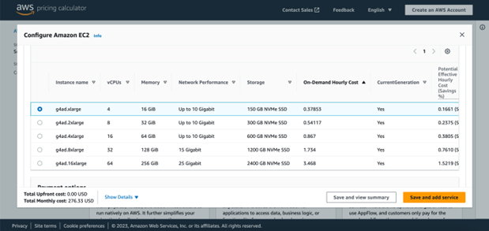

El costo de la instancia al mes es de 276.33 USD.

---

### 15.

Con esta instancia seleccionada modifique el uso de 100 % a 10 horas al mes. Registre el costo mensual bajo demanda en su reporte.

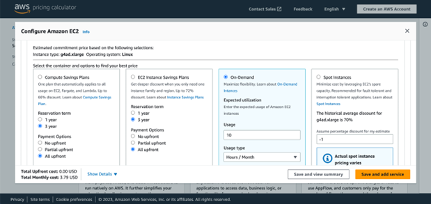

El costo de la instancia al mes es de 3.79 USD.

---

### 16.

Haga click en Guardar y agregar servicio. Regresará a la página principal de la calculadora. Seleccione ahora el servicio S3 de almacenamiento.

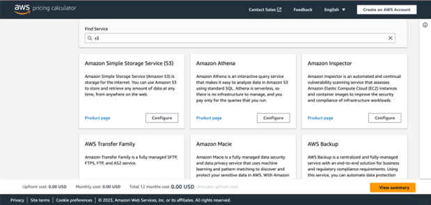

---

### 17.

Ingrese una descripción y seleccione la Región Norte de Virginia.

---

### 18.

Mantenga seleccionados S3 Standard y Data Transfer.

---

### 19.

En S3 Standard ingrese información para la cantidad de datos a almacenar por mes y deje los demás campos como están. Seleccione Mostrar cálculos para desplegar el cálculo del costo. Inclúyalo en su reporte.

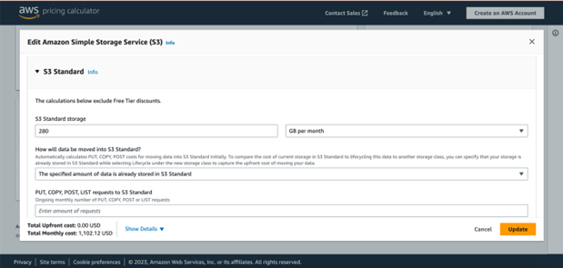

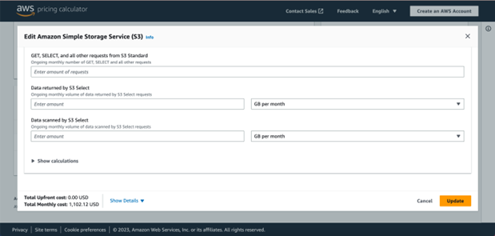

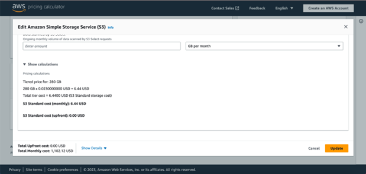

El costo de la instancia al mes es de 1,102.12 USD.

---

### 20.

En Transferencia de datos ingrese información para la cantidad de datos a transferir hacia y desde internet. Seleccione Mostrar cálculos para desplegar el cálculo del costo. Inclúyalo en su reporte.

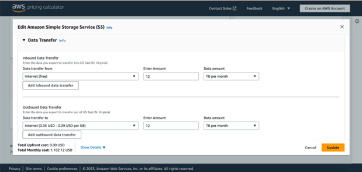

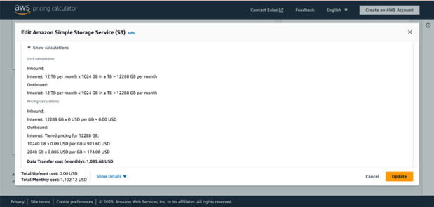

El costo de la instancia al mes es de 1,102.12 USD. De este costo total, el costo de transferir datos es 1,095.68.

---

### 21.

Incluya el costo mensual total de S3 en su reporte.

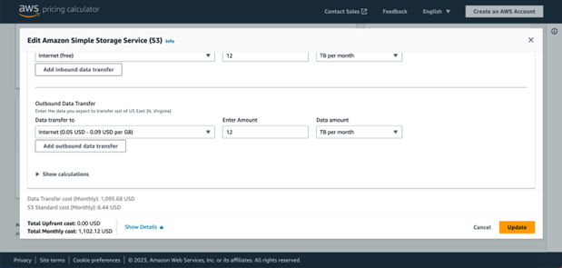

El costo total mensual de S3 es de 1,102.12 USD este hace referencia a 6.44 USD de costo estándar de S3 y 1,095.68 USD del costo de la transferencia de datos.

---

### 22.

Regrese ahora a la parte superior de la pantalla y active el servicio S3 Glacier Deep Archive.

---

### 23.

En el nuevo campo creado ingrese datos para Glacier Deep Archive. Fije los datos de cantidad de datos a almacenar igual a los fijados en S3 Standard. Para aquellos campos que sean diferentes fije su valor en 0 (excepto en tamaño promedio de objeto, el cual puede dejar en su valor por defecto). En su reporte incluya la información ingresada y el costo por mes estimado en ambos servicios. Compare los costos de los dos servicios. ¿Qué tan grande es la diferencia entre ellos? ¿Por qué hay una diferencia?

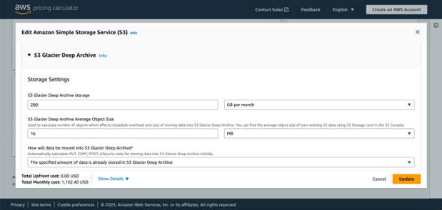

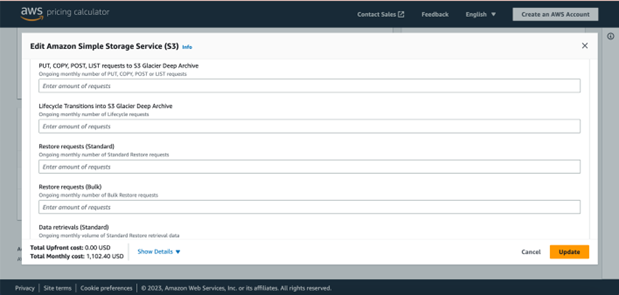

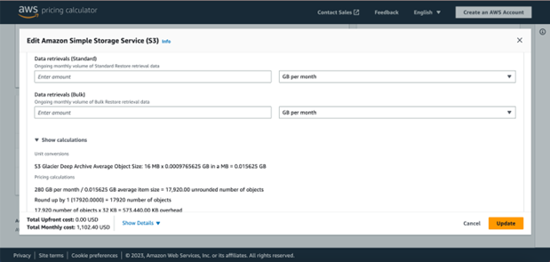

---

### 24.

Haga click en Guardar y agregar servicio. Regresará a la página principal de la calculadora. Seleccione ahora Ver Resumen.

---

### 25.

Tome un pantallazo y reporte el costo estimado mensual y anual.

---

### 26.

Click en compartir, luego en Aceptar y continuar, copie el enlace público y compátalo en su reporte y en el canal #general de Slack.

Link del Estimador de AWS:
https://calculator.aws/#/estimate?id=42887a22b105ff654bd711b2c88519def9535bf3

Foto de publicado en Slack:

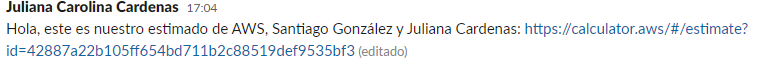

---

### 27.

Note que también puede exportar el estimado a PDF y CSV.
